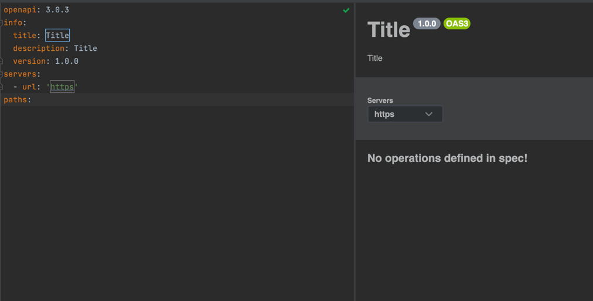

# Open API Specification

https://www.jetbrains.com/help/idea/openapi.html#http-client
- this is for API doc with Swagger.
- autogeneratable.
- by api specification, able to generate API doc. and also there is some trial of generating API source code as well.
- able to preview with intellij
